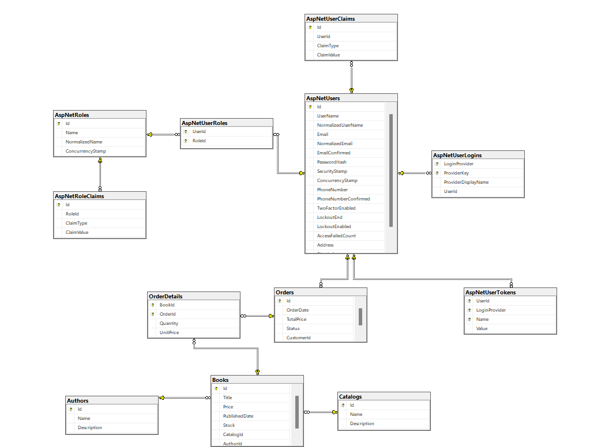

# BookStoreAPI

BookStoreAPI is a RESTful API built using .NET Core. It provides functionality to manage a bookstore's inventory, customers, and orders. The application is designed with a code-first approach using Entity Framework and integrates JWT-based authentication for secure access.

## Features

- **Book Management**: Add, update, delete, and retrieve books.
- **Customer Management**: Register customers and manage their details.
- **Order Processing**: Create and manage book orders.
- **Authentication**: Secure endpoints using JSON Web Tokens (JWT).
- **Admin Management**: Create and manage admin accounts.
- **Author and Catalog Management**: Manage authors and organize books into catalogs.

## Prerequisites

Before running this application, ensure you have the following installed:

- .NET SDK (version 6.0 or later)
- SQL Server
- Postman or any API testing tool (optional)

## Installation

1. Clone the repository:
   ```bash
   git clone https://github.com/mahmoud-40/BookStoreAPI.git
   cd BookStoreAPI
   ```

2. Restore dependencies:
   ```bash
   dotnet restore
   ```

3. Set up the database:
   - Update the connection string in `appsettings.json` to match your SQL Server configuration.
   - Apply migrations to create the database:
     ```bash
     dotnet ef database update
     ```

4. Run the application:
   ```bash
   dotnet run
   ```

5. The API will be available at `https://localhost:5001` (or `http://localhost:5000` for non-HTTPS).

## Endpoints

### Account Management
- **POST** `/api/Account`: Login
- **PUT** `/api/Account/ChangePassword`: Change Password
- **POST** `/api/Account/logout`: Logout

### Admin Management
- **POST** `/api/Admin`: Create a new admin
- **GET** `/api/Admin`: Get all admins

### Author Management
- **GET** `/api/Author`: Get all authors
- **POST** `/api/Author`: Add an author
- **GET** `/api/Author/{id}`: Get an author by id
- **PUT** `/api/Author/{id}`: Update an author
- **DELETE** `/api/Author/{id}`: Delete an author

### Book Management
- **GET** `/api/Book`: Get all books
- **POST** `/api/Book`: Create a book
- **GET** `/api/Book/{id}`: Get a book by id
- **PUT** `/api/Book/{id}`: Update a book
- **DELETE** `/api/Book/{id}`: Delete a book

### Catalog Management
- **GET** `/api/Catalog`: Get all catalogs
- **GET** `/api/Catalog/{id}`: Get a catalog by id
- **POST** `/api/Catalog/{catalogId}/books/{bookId}`: Add a book to a catalog

### Customer Management
- **POST** `/api/Customer`: Create a new customer
- **GET** `/api/Customer`: Get all customers
- **GET** `/api/Customer/{id}`: Get a customer by id
- **PUT** `/api/Customer/{id}`: Edit a customer
- **PUT** `/api/Customer/ChangePassword`: Change password

### Order Management
- **POST** `/api/Order`: Add a new order
- **GET** `/api/Order`: Get all orders
- **GET** `/api/Order/{id}`: Get an order by id
- **DELETE** `/api/Order/{id}`: Delete an order
- **PUT** `/api/Order/{id}`: Update an order status

## Database Schema

Below is the database schema used in the BookStoreAPI project:



### Key Entities

1. **AspNetUsers**: Stores user information (customers, admins) with authentication details.
2. **Books**: Represents books available in the bookstore.
3. **Authors**: Contains author details.
4. **Orders**: Tracks customer orders.
5. **OrderDetails**: Includes details of books in each order.
6. **Catalogs**: Organizes books into specific categories.

### Relationships
- **AspNetUsers** and **Orders**: A one-to-many relationship where a user can place multiple orders.
- **Orders** and **OrderDetails**: Each order can have multiple books associated with it.
- **Books** and **Authors**: A many-to-one relationship where books are written by authors.
- **Books** and **Catalogs**: A many-to-one relationship to organize books into catalogs.

## Technologies Used

- **.NET Core**: Backend framework.
- **Entity Framework Core**: Database management.
- **SQL Server**: Database.
- **JWT**: Authentication and authorization.

## Contributing

Contributions are welcome! Please follow these steps:

1. Fork the repository.
2. Create a feature branch:
   ```bash
   git checkout -b feature-name
   ```
3. Commit your changes:
   ```bash
   git commit -m "Describe your feature"
   ```
4. Push to the branch:
   ```bash
   git push origin feature-name
   ```
5. Create a pull request.

## License

This project is licensed under the MIT License. See the LICENSE file for details.

## Contact

For any questions or feedback, please contact:

- **Email**: mahmouda.mawlaa@gmail.com
- **GitHub**: [mahmoud-40](https://github.com/mahmoud-40)

